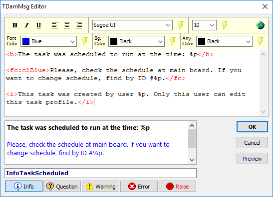

# Dam

## Delphi Message Dialogs with Formatted Text


## Introduction

Almost every application you build, you need to add message dialogs.

Delphi provides you a few options, like ShowMessage, MessageDlg and MessageBox.

As your project gets bigger, the dialogs may mess up your code, mainly if you need to write many lines in the messages, with many parameters.

If you need to format some part of the message, you need to add labels in a custom form. This is could be really bad.

Figure out this message:

```delphi
begin
  ShowMessage('The task was scheduled to run at the time: '+aTime+'.'+#13#10+
    #13#10+
    'Please, check the schedule at main board.'+
    ' If you want to change schedule, find by ID #'+IntToStr(IDNumber)+'.'+#13#10+
    #13#10+
    'This task was created by user '+aUserName+'. Only this user can edit this task profile.');
end;
```

So, I think this is really ugly, don't you think? :persevere:

**And if I tell you this can be written much more beautiful:** :smile:

```delphi
begin
  InfoTaskScheduled([aTime, IDNumber, aUserName]);
end;
```

This component allows you to manage all your application messages in a "container". You can create de message dialog with a wizard creator, allowing you to format the message (bold, italic, underline, font name, font size, text background color, align center, align right, use tab alignment, clicable links, etc).

You can specify the message buttons, the icon, the form title, and much more.

Then you specify a name for the message. So, you can call the message at any part of your application, just calling the method by the message name!

If you specify parameters in the message text, then when you call the message method, you can specify parameters that will be replaced in the text.

*Please read carefully this documentation to know how this component works.* :grin:

## Screenshots

The Dam container listing all messages created, stored at DFM:


The Message Wizard Creator, to customize the message dialog:



The Message Dialog: :stuck_out_tongue:


## How to install

1. First you need to install my HTLabel component. Get it here: https://github.com/digao-dalpiaz/HTLabel

   *This is a label with HTML formatting component. The messages uses this component to display formatted text.*

2. Open the package DamPackage in the Delphi. Then Build and Install.

3. Add "Lib" sub folder to Delphi Library Path.

4. Run AfterBuild.bat to publish DFM and RES to Lib folder.

> Supports Delphi XE2..Delphi 10.3 Rio

# Supported Languages

At this time, the following languages are available for messages:

- English
- Portuguese
- Spanish
- German
- Italian
- Chinese
- Japanese
- Greek
- Russian
- French

The language set the caption of buttons in the message dialogs, like OK, Cancel, Yes, No, and the title of the form, when Information, Question, Warning, Error and Message (custom). The form title can be changed in the message properties and can be automatically set by other objects, like parent form title, main form title and application title.

> You can open an issue to send me a new language translation or correct current translation

# How to use

The main ideia is to drop one TDam in the main form, or main data module. The TDam is a container that have all TDamMsg (message dialog).

To manage messages, just double-click at the TDam component.

**But how to call the messages?**

The TDam has a property called `DamUnitName`. Here you define a unit name to contain all message methods. When you use the function **Build Unit**, the component will create this unit automatically at project folder with the methods based in all created messages (with the same name as the message name).

So, at any unit, you just add a uses to this unit, and call the message you want by message name. If the message has parameters, the method will be declared automatically asking for parameters in an array.

**Yeah, but if I'am at the same unit that is the TDam and TDamMsg messages, if I call method by message name, the Delphi think I'm reffering the object of message!**

This is true, and because of that, the component has a object hidden function. You only need to name the message starting with `_`. So the unit builder will remove this character to name the method and the Delphi will not confuse the two things.

I recomend you to create all messages named starting with the `_` character.

If you use the wizard, the name will be automatically start with this character.

*There is a button on the Dam manager to hide/un-hide all selected messages.*

> Remember, every time you change the messages, you need to rebuld the unit. Just click the button Build Unit to update.

**OK, but I don't want to use this unit! Is there another method?**

Yes, of course. You can call the message by using the functions of TDamMsg object. Just use the message object `Run` or `RunAsBool` functions. In this case I recomend you to not hide the message, so you can call by the object name as is.

> But I honestly recommend you to use the unit as it will make much more sense. :wink:

**Can I use more than one TDam container in my application?**

Yes, you can. The TDam allows you to define some configurations, like the message font and sounds. So you may have more than one TDam to have this group of configuration. Besides that, you can use various TDam to group messages by category. You can put TDam in specific forms, eighter, but remember that the containter needs to exist to fire the messages, of course.

## TDam properties

`DamDefault: Boolean` = Defines if this TDam will be used to fire quick messages (please read Quick Messages section). You only can have one defined as Default in the application.

`DamUnitName: String` = Specify the unit name to be created with all message methods in the project folder. Do not specify file extension, because the component will complete the name automatically with ".pas" extension.

`HandleExceptions: Boolean` = Defines this TDam to handle all application exceptions, showing the error message with the same dialog as all other Dam messages. Only one TDam can be set to handle exceptions in the application.

`Language: TDamLanguage` = Defines the language used by message buttons and message form title.

`MessageFont: TFont` = Defines the text font of messages

`PlaySounds: Boolean` = Enabled system sounds when showing messages of kind Warning, Question and Error.

## TDamMsg properties

`Button1: String` = Caption of Button 1 on message dialog. Available when Buttons=dbOne/dbTwo/dbThree.

`Button2: String` = Caption of Button 2 on message dialog. Available when Buttons=dbTwo/dbThree.

`Button3: String` = Caption of Button 3 on message dialog. Available when Buttons=dbThree.

`Buttons: TDamMsgButtons` = Defines the buttons in the message dialog:
- dbOK: Defines one button OK
- dbYesNo: Defines two buttons Yes/No
- dbOne: Defines one button by Button1 defined caption
- dbTwo: Defines two buttons by Button1 and Button2 defined captions
- dbThree: Defines three buttons by Button1, Button2 and Button3 defined captions

`CustomIcon: TIcon` = Defines a custom icon to show in the messsage dialog. This icon only is shown when Icon=diCustom.

`CustomTitle: String` = Defines a custom title for message form. This caption is only used then Title=dtCustom.

`Icon: TDamMsgIcon` = Defines the icon in the message dialog:
- diApp: The application icon
- diInfo: The information system icon
- diQuest: The question system icon
- diWarn: The warning system icon
- diError: The error system icon
- diCustom: The icon is defined in the CustomIcon property

`Message: String` = The message text. Please use the message wizard creator for text formatting or read the HTLabel documentation.

`Name: String` = Message object name. If then name starts with `_` character, means the message is hidden, so the Delphi will not think you are calling this object when you call the method of message having the same name.

`RaiseExcept: Boolean` = Set this message as a RAISE message. When you call this message, will be raised an exception with the message text. In this case, you need to use at least one TDam with HandleExceptions=True, otherwise the message will not be formatted with Dam customization.

`SwapFocus: Boolean` = By default, when a message is fired, always the first button on the left will start with focus. If you enable this option, this message will start the focus at last button (the button at right).

`Title: TDamMsgTitle` = Defines the message form title
- dtApp: The title is the same as application title
- dtParentForm: The title is the same as parent form title
- dtMainForm: The title is the same as main form title
- dtByIcon: The title is defined by Icon property (this uses language resource)
- dtCustom: The title is defined by CustomTitle property

