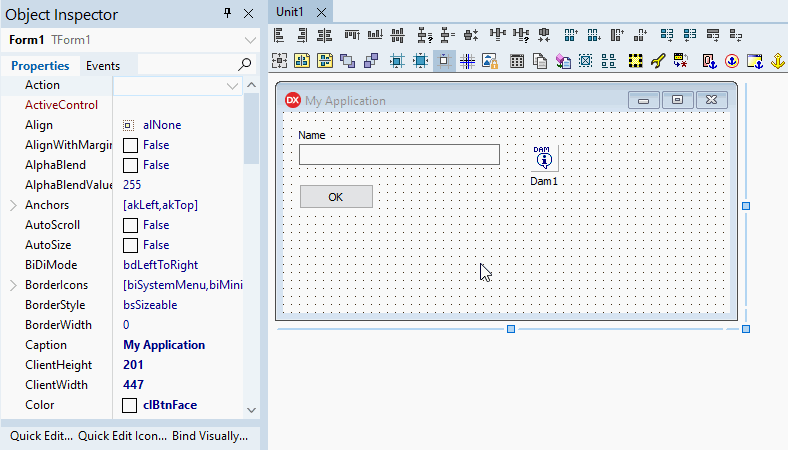
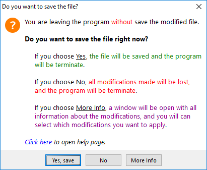
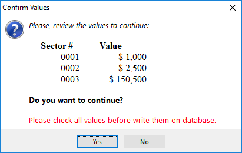
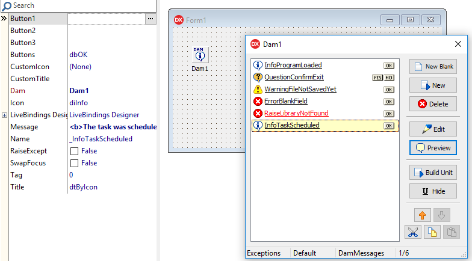
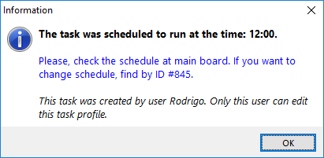

# Dam

## Delphi and Lazarus Message Dialogs with Formatted Text


[](https://ko-fi.com/C0C53LVFN)




- [What's New](#whats-new)
- [Introduction](#introduction)
- [Screenshots](#screenshots)
- [How to install](#how-to-install)
- [Supported Languages](#supported-languages)
- [How to use](#how-to-use)
- [Message parameters](#message-parameters)
- [TDam properties](#tdam-properties)
- [TDam events](#tdam-events)
- [TDamMsg properties](#tdammsg-properties)
- [Escaping HTML tags and parameters](#escaping-html-tags-and-parameters)
- [Quick Messages](#quick-messages)
- [Raising exceptions](#raising-exceptions)
- [How to change Language file](#how-to-change-language-file)
- [Delphi versions below XE8 remark](#delphi-versions-below-xe8-remark)
- [History](#history)

## What's New

- 03/14/2021 (Version 4.12)

   - Included Turkish language support.

- 03/13/2021 (Version 4.11)

   - Supporting message buttons caption with any length, automatically increasing button width.
   - Removed CompInstall.exe from component sources due to AV false positive warning (now you can get it directly from CompInstall repository).

- 03/05/2021 (Version 4.10)

   - New OnLinkClick event.

- 02/10/2021 (Version 4.9)

   - Compatibility with new DzHTMLText component version (now DzHTMLText supports FMX).
   - Removed Delphi XE2 from the list of environments as it was never possible to compile in this version.
   - Fixed Delphi XE3 compatibility.

- 12/18/2020 (Version 4.8)

   - Updated Component Installer app (Fixed call to rsvars.bat when Delphi is installed in a path containing spaces characters).

- 11/27/2020 (Version 4.7)

   - Included EDam exception shortcut in Dam file generated unit (When using Build button in Dam Messages Manager form).

- 11/11/2020 (Version 4.6)

   - New EDam exception class (read [Raising exceptions](#raising-exceptions)).
   - Implemented HTML tags escape and parameter/exception constant bypass (read [Escaping HTML tags and parameters](#escaping-html-tags-and-parameters)).

- 10/31/2020 (Version 4.5)

   - Included Delphi 10.4 auto-install support.

- 10/27/2020 (Version 4.4)

   - Fixed previous Delphi versions (at least on XE2, XE3, XE4 and XE5) package tag. It was causing package compilation error.
   - Fixed the use of System.ImageList unit because it's only available from XE8.
   - Fixed .ToString conversion because is not available in some Delphi versions.

- 10/26/2020 (Version 4.3) (*Minimum DzHTMLText version: 2.6*)

   - Changed TDzHTMLText version dependency check to use new internal version control.

- 10/26/2020 (Version 4.2)

   - Updated CompInstall to version 2.0 (now supports GitHub auto-update)

- 10/18/2020 (Version 4.1) (*Minimum DzHTMLText version: 2.04*)

   - Implemented DzHTMLText version internal check.

- 10/14/2020 (Version 4.0)

   - **Lazarus support**. :smile:
   
   *Remarks:*
   
   - The TRichEdit control in Message Editor Dialog was replaced by a TMemo, because in non Windows systems this control doesn't exist. So the syntax highlight under HTML tags are also no longer displayed in the editor.
   - At this time, the Cut, Copy and Paste commands for messages in the Lazarus IDE environment are not yet available.

- 09/24/2020

   - Fixed message background color and message dialog width x message width when using application VCL Theme Styles (issue #17).   

- 08/11/2020

   - Changed DialogPosition=dpActiveFormCenter to always get absolute window rect. When active window is MDI child, then message dialog will be centered by active form absolute screen position.

- 08/07/2020

   - Fixed dialog position when ActiveForm is MDI Child and using DialogPosition=dpActiveFormCenter (issue #16).

- 08/03/2020

   - Included HelpContext and HelpKeyword support in TDamMsg.

- 07/30/2020

   - Internal compatibility with TDzHTMLText change (TStrings text property). **Please, update TDzHTMLText component!** :warning:

- 07/21/2020

   - Included Dutch language support.

- 05/25/2020

   - Implemented ImageList support, using DzHTMLText images support (use tag ``). **It is necessary to update the TDzHTMLText component.** :warning:

- 05/03/2020

   - Updated CompInstall to version 1.2

- 05/02/2020

   - New global function `DamParams` to fill parameters when using Dam Message methods. This is needed for Delphi versions below XE8, because didn't have dynamic array as type support.
   - Removed uses `System.ImageList` from DamList unit (design-time package), because is not supported by Delphi versions below XE8.
   - Removed `AutoWidth` property in TDam. Now there is a new property `FixedWidth` in TDamMsg component, so you can specify custom width by message. The component will keep auto-width internal function if FixedWidth is zero (default value).
   - Fixed message window width bug behavior because of DzHTMLText updates.
   - Fixed message text incorrect center alignment position when form at minimum size (issue #5).
   - Changed `CenterButtons` property to default false, because new Windows dialogs style have buttons aligned at right.

- 04/26/2020

   - Now you can include images in the message text area, by using new `<imgres:{resource_name}>` tag. Just add PNG image to the application resources and use the tag to reference them into the message. This implementation is in DzHTMLText component, used by Dam. You just need to update your DzHTMLText component and this feature will be available. Please read the [DzHTMLText Image Tag section](https://github.com/digao-dalpiaz/DzHTMLText#image-tag) to more info. **Important: images won't be visible at design-time**.

- 04/19/2020

   - Renamed Dam_Resource.rc to Dam_Resource.rc_ because .rc extension is not considered as code information. If using GitHub default Delphi .gitignore file, for example, then .rc will be ignored. Another example: backuping data with .rc extension ignored.

- 10/07/2019

   - Include OnShowMessage event.

- 10/06/2019

   - Include Messages Find function: Now when you are designing messages, in the Dam message container, there is a new button "Find". If you have a lot of messages, you can find them by message name and/or message text.
   - Include DialogBorder property.
   - Fix Message Editor form to use background color property in the preview area.
   - Adjust Message Dialog to minimum of Width=300px and Height=100px.
   - Adjust Message Dialog Max Width to be 75% of Monitor Width.

- 10/05/2019

   - Include DialogPosition property.

- 05/03/2019

   - Include Polish language support. Thanks to @jackdp.

- 02/11/2019

   - Include auto install app

- 02/08/2019

   - The component had to be adapted because of a name change in the dependent HTML component. Please check the dependency component page to correct uninstall older version and update to the new version. :warning:

- 02/07/2019

   - Add Win64 support (library folders changed!) :warning:

- 02/06/2019

   - Add new property AutoWidth to allow message form auto stretch horizontally according message text.   
   - Add new property CenterButtons to arrange buttons on center at message form, otherwise they will be right-aligned.

- 02/05/2019

   Add new properties MessageColor and ButtonsColor on TDam component, to allow message dialog customization.

## Introduction

Almost every application you build, you need to add message dialogs.

Delphi provides you a few options, like ShowMessage, MessageDlg and MessageBox.

As your project gets bigger, the dialogs may mess up your code, mainly if you need to write many lines in the messages, with many parameters.

If you need to format some part of the message, you need to add labels in a custom form. This is could be really bad.

Look at this message:

```delphi
begin
  ShowMessage('The task was scheduled to run at the time: '+aTime+'.'+#13#10+
    #13#10+
    'Please, check the schedule at main board.'+
    ' If you want to change schedule, find by ID #'+IntToStr(IDNumber)+'.'+#13#10+
    #13#10+
    'This task was created by user '+aUserName+'. Only this user can edit this task profile.');
end;
```

So, I think this is really ugly, don't you think? :persevere:

**With Dam you can write this same message like this:** :smile:

```delphi
begin
  InfoTaskScheduled([aTime, IDNumber, aUserName]);
end;
```

This component allows you to manage all your application messages in a "container". You can create the message dialog with a wizard creator, allowing you to format the message (bold, italic, underline, font name, font size, text background color, align center, align right, use tab alignment, clickable links, etc).

You can specify the message buttons, the icon, the form title, and much more.

Then you specify a name for the message. So, you can call the message at any part of your application, just calling the method by the message name!

If you specify parameters in the message text, then when you call the message method, you can specify parameters that will be replaced in the text.

*Please read carefully this documentation to know how this component works.* :grin:

## Screenshots

The Dam container listing all messages created, stored at DFM:



The Message Wizard Creator, to customize the message dialog:


The Message Dialog: :stuck_out_tongue:



> The shortcut `CTRL+C` is available on message form to copy the message to clipboard.

## How to install

- First you need to install my **DzHTMLText** component. Get it here: https://github.com/digao-dalpiaz/DzHTMLText

   *This is a label with HTML formatting component. The messages uses this component to display formatted text.*

### Delphi auto installation

1. Download Component Installer from: https://github.com/digao-dalpiaz/CompInstall/releases/latest
2. Put **CompInstall.exe** into the component repository sources folder.
3. Close Delphi IDE and run **CompInstall.exe** app.

> If you are installing DzHTMLText and Dam at once, using Component Installer utility, after installing DzHTMLText you gonna need to open and close Delphi before installing Dam (this is needed just to update Library Path file used by MSBUILD).

### Delphi manual installation

1. Open **Dam.groupproj** in the Delphi.

2. Ensure **Win32** Platform and **Release** config are selected at both packages.

3. Right-click at root item in the tree and choose **Build All**.

4. If you want to use 64 bit platform, select this platform at DamPackage and do a new Build in this package.

5. Right-click at **DamDesignPackage** and choose **Install**.

6. Add "Win32\Release" sub folder to Delphi Library Path (Tools\Options), on 32-bit option. If you will use 64 bit platform, add "Win64\Release" sub folder on 64-bit option.

7. Run **AfterBuild.bat** to publish DFM and RES to Release folders.

> Supports Delphi XE3..Delphi 10.4

### Lazarus installation

1. Go to menu Package > Open Package File (.lpk) and load **LazDamPackage.lpk**, and click into **Compile**.

2. Go to menu Package > Open Package File (.lpk) and load **LazDamDesignPackage.lpk**, and click into **Use > Install**.

# Supported Languages

At this time, the following languages are available for messages:

- English
- Portuguese
- Spanish
- German
- Italian
- Chinese
- Japanese
- Greek
- Russian
- French
- Polish
- Dutch
- Turkish

The language set the caption of buttons in the message dialogs, like OK, Cancel, Yes, No, and the title of the form, when Information, Question, Warning, Error and Message (custom). The form title can be changed in the message properties and can be automatically set by other objects, like parent form title, main form title and application title.

> You can open an issue to send me a new language translation or correct current translation

# How to use

The main idea is to drop one TDam in the main form, or main data module. The TDam is a container that have all TDamMsg (message dialog).

To manage messages, just **double-click** at the TDam component, or right-click and choose **Manage Dam Messages**.

**But how to call the messages?**

The TDam has a property called `DamUnitName`. Here you define a unit name to contain all message methods. When you use the function **Build Unit**, the component will create this unit automatically at project folder with the methods based in all created messages (with the same name as the message name).

So, at any unit, you just add a uses to this unit, and call the message you want by message name. If the message has parameters, the method will be declared automatically asking for parameters in an array.

**Yeah, but if I am at the same class (TForm/TDataModule) that is the TDam and TDamMsg messages, if I call method by message name, the Delphi think I'm referring the object of message!**

This is true, and because of that, the component has a object hidden function. You only need to name the message starting with `_`. So the unit builder will remove this character to name the method and the Delphi will not confuse the two things.

I recommend you to create all messages named starting with the `_` character.

If you use the wizard, the name will be automatically start with this character.

*There is a button on the Dam manager to hide/un-hide all selected messages.*

> Remember, every time you change the messages, you need to rebuild the unit. Just click the button Build Unit to update.

**OK, but I don't want to use this unit! Is there another method?**

Yes, of course. You can call the message by using the functions of TDamMsg object. Just use the message object `Run` or `RunAsBool` functions. In this case I recommend you to not hide the message, so you can call by the object name as is.

> But I honestly recommend you to use the unit as it will make much more sense. :wink:

**Can I use more than one TDam container in my application?**

Yes, you can. The TDam allows you to define some configurations, like the message font and sounds. So you may have more than one TDam to have this group of configuration. Besides that, you can use various TDam to group messages by category. You can put TDam in specific forms, either, but remember that the container needs to exist to fire the messages, of course.

If you are using more than one TDam, I recommend you to set the same `DamUnitName` at all TDam components, so when you call **Build Unit** button, it will be generated a single unit with all messages of all TDam containers. So you can use this single unit at all other units of your project to call any message.

**Message result codes:**

If you call message by method of message name, the method will be a procedure if message has only one button.

If message has two or three buttons, the method will be a function. When it has two buttons, the function will always return boolean value, returning true if first button on the left was clicked, or returning false if second button (last button on the right) was clicked.

When message has three button, the function returns integer value 1, 2 or 3, depending on which button was pressed in the message dialog. The first button is the left one; the second is the middle button; the third button is the right button.

So, when using three buttons, you can use a variable or even a `case`:

```delphi
case QuestionSaveFile([aFileName]) of
  1: DoSaveFile; //Yes button
  2: {continue}; //No button
  3: Abort; //Cancel button
end;
```

## Message parameters

If you want to use replaceable parameters in the message, just type `%p`. You can specify multiple parameters in the same message. When you are calling message, the parameters array are sequentially in the same order they are typed in the message.

The parameters array are variant type, so they don't need conversions.

Example:
```delphi
//TDamMsg Message property = 'This is a %p message number %p at time %p'
MyCustomMessage(['test', 123, Now]);
//or
MsgInfo('This is a %p message number %p at time %p', ['test', 123, Now]);
```

## TDam properties

`CenterButtons: Boolean` = Define if the buttons at message form will be aligned at center. If this property is false, the buttons will be aligned at right of form.

`DamDefault: Boolean` = Defines if this TDam will be used to fire quick messages (please read Quick Messages section). You only can have one defined as Default in the application.

`DamUnitName: String` = Specify the unit name to be created with all message methods in the project folder. Do not specify file extension, because the component will complete the name automatically with ".pas" extension.

`DialogPosition: TDamDlgPosition` = Defines the dialog form start position:
- dpScreenCenter: center the window based on the screen
- dpMainFormCenter: center the window based on the main window
- dpActiveFormCenter: center the window based on the active window

`DialogBorder: Boolean` = Defines if the window of message dialog will contain borders. You can disable this property to create modern dialog themes.

`HandleExceptions: Boolean` = Defines this TDam to handle all application exceptions, showing the error message with the same dialog as all other Dam messages. Only one TDam can be set to handle exceptions in the application.

`Images: TCustomImageList` = Allows you to set an ImageList, using tag `` in the message text, where `idx` is image index.

`Language: TDamLanguage` = Defines the language used by message buttons and message form title. *When you place an instance of TDam component, this property will be initialized according to the system current language. If there is no language available according to the system, English language will be set. This property has no default value, precisely because it should store the language being defined.*

`MessageFont: TFont` = Defines the text font of messages

`PlaySounds: Boolean` = Enable system sounds when showing messages of Warning, Question and Error kinds.

`MessageColor: TColor` = Define background color of message area on message dialog.

`ButtonsColor: TColor` = Define background color of buttons area on message dialog.

## TDam events

`OnLinkClick(Sender: TObject; Msg: TDamMsg; const Target: string; var Handled: Boolean; var CloseMsg: Boolean; var MsgResult: TDamMsgRes)`
This event will be triggered when clicked on a link contained in the message.

By default the link target will be automatically opened using ShellExecute from Windows API, so if the target is a web link, the default browser will open the link, or if the target is a system file, the path will be executed/opened by Windows.

If you want to bypass this behavior, use this event and set `Handled` to True. You can also set `CloseMsg` to True and `MsgResult` flag when you want to close the message window.

`OnShowMessage(Sender: TObject; Msg: TDamMsg; var MsgText: String; var Handled: Boolean; var MsgResult: TDamMsgRes)`
Fires before a Dam Message is displayed, allowing you to intercept messages and even bypass message display, by using Handled parameter.

> Warning! If you bypass an Exception message, the component will not raise an exception, continuing the code execution (unless you create your own exception at event procedure).

## TDamMsg properties

`Button1: String` = Caption of Button 1 on message dialog. Available when Buttons=dbOne/dbTwo/dbThree.

`Button2: String` = Caption of Button 2 on message dialog. Available when Buttons=dbTwo/dbThree.

`Button3: String` = Caption of Button 3 on message dialog. Available when Buttons=dbThree.

`Buttons: TDamMsgButtons` = Defines the buttons in the message dialog:
- dbOK: Defines one button OK
- dbYesNo: Defines two buttons Yes/No
- dbOne: Defines one button by Button1 defined caption
- dbTwo: Defines two buttons by Button1 and Button2 defined captions
- dbThree: Defines three buttons by Button1, Button2 and Button3 defined captions

`CustomIcon: TIcon` = Defines a custom icon to show in the message dialog. This icon only is shown when Icon=diCustom.

`CustomTitle: String` = Defines a custom title for message form. This caption is only used then Title=dtCustom.

`FixedWidth: Integer` = Defines a fixed width of message window, in pixels. If this value is zero (default), then the window width will be automatically calculated according to the message text. *There is a minimum and maximum fixed limits to the message form*.

`HelpContext: THelpContext` = Defines help context. If this property is defined, when the message dialog will display a help button and will open application help on context target. It's also possible to use F1 key.

`HelpKeyword: String` = Defines help keyword. If this property is defined, when the message dialog will display a help button and will open application help on keyword target. It's also possible to use F1 key.

`Icon: TDamMsgIcon` = Defines the icon in the message dialog:
- diApp: The application icon
- diInfo: The information system icon
- diQuest: The question system icon
- diWarn: The warning system icon
- diError: The error system icon
- diCustom: The icon is defined in the CustomIcon property

`Message: String` = The message text. Please use the message wizard creator for text formatting or read the HTLabel documentation. The parameters replaceable are defined by `%p` at message text. Use the parameters at array in the message method in the same order as specified in the message text. You can also specify the literal `{except}` to catch current exception message and replace at this variable in the message text (please, see exception examples).

`Name: String` = Message object name. If then name starts with `_` character, means the message is hidden, so the Delphi will not think you are calling this object when you call the method of message having the same name.

`RaiseExcept: Boolean` = Set this message as a RAISE message. When you call this message, will be raised an exception with the message text. In this case, you need to use at least one TDam with HandleExceptions=True, otherwise the message will not be formatted with Dam customization.

`SwapFocus: Boolean` = By default, when a message is fired, always the first button on the left will start with focus. If you enable this option, this message will start the focus at last button (the button at right).

`Title: TDamMsgTitle` = Defines the message form title
- dtApp: The title is the same as application title
- dtParentForm: The title is the same as parent form title
- dtMainForm: The title is the same as main form title
- dtByIcon: The title is defined by Icon property (this uses language resource)
- dtCustom: The title is defined by CustomTitle property

## Escaping HTML tags and parameters

All message parameters are automatically "escaped" by component.

Examples:

```delphi
procedure Test1;
begin
  MyCustomMessage(['This will display <b> literal string', 'This will display "%p" literal string']);
end;

procedure Test2;
begin
  MsgInfo('<b>First message parameter</b>: %p', ['Here I want to display literal <> characters']);
end;
```

- The message fixed part is **always HTML notation** with parameter and exception identifiers support (`%p` and `{except}`).
- The parameters array is **always auto-escaped** allowing any string literal character (**HTML notation are NOT allowed in parameters array**).

If you want to display HTML literal characters in fixed message part, please check escape constants at [DzHTMLText documentation](https://github.com/digao-dalpiaz/DzHTMLText#literal-tag-character).

## Quick Messages

```delphi
procedure MsgInfo(const Msg: String; const Params: TDamParams = nil); //message with Information icon
procedure MsgWarn(const Msg: String; const Params: TDamParams = nil); //message with Warning icon
procedure MsgError(const Msg: String; const Params: TDamParams = nil); //message with Error icon
function MsgQuest(const Msg: String; const Params: TDamParams = nil): Boolean; //message with Question mark icon
procedure MsgRaise(const Msg: String; const Params: TDamParams = nil); //message with Error icon (this raises an exception)

procedure ShowErrorMsg; //show current error message
function CaptureErrorMsg: String; //get current error message
```

These methods are available globally, at unit `DamUnit` or at unit name you have specified in the DamUnitName property.

You can show quick messages directly on the code, just typing the messages and parameters you like.

> These methods will use the TDam container that is defined as *Default*. So you need to have one TDam available with `DamDefault` property set to **True**.

The function `MsgQuest` results true if Yes button was pressed, or returns false if No button was pressed.

The method `ShowErrorMsg` shows the currently exception. You can use this as try..except block.

The function `CaptureErrorMsg` allows you to get the error message on current exception. You should use this at try..except block.

**Exception catch example:**

```delphi
try
  DoSomeStuff;
except
  ShowErrorMessage; //will show error message dialog using Dam concept
end;
```

```delphi
try
  DoSaveFile;
except
  MsgError('Fatal error saving file: %p', [CaptureErrorMsg]);
end;
```

If you specify literal `{except}` at message text, this will be replaced by the current error message:

```delphi
try
  DoSaveFile;
except
  MsgError('Fatal error saving file: {except}'); //don't need to use CaptureErrorMsg function!
end;
```

You can also re-raise an exception:

```delphi
try
  DoSaveFile;
except
  raise EDam.Create('Fatal error saving file: {except}'); //re-raise a new exception with better text message
end;
```

## Raising exceptions

You can set `RaiseExcept` parameter on a Dam Message object, so when the message is called, an exception will be raised.

**Remember:** to take advantage of Dam resources, you need to set `HandleExceptions` on Dam container object. When an exception is raised, Dam will intercept this exception and display custom dialog.

Examples:

```delphi
procedure TestException_Generic;
begin
  raise Exception.Create('This is my generic exception');     
  //HTML tags are NOT allowed when using generic exception
end;

procedure TestException_DamRunTimeCreation;
begin
  raise EDam.Create('This is my <b>exception</b> with parameter %p', ['First parameter']);
end;

procedure TestException_DamDesignTimeCreation;
begin
  raise EDam.Create(MyCustomMessage, ['First parameter']);
  //MyCustomMessage represents a TDamMsg object created at design-time
end;

procedure TestException_DamDesignTimeCreation_ByProperty;
begin
  _MyCustomMessage.Run(['First parameter']);
  //or
  MyCustomMessage(['First parameter']);
  
  //MyCustomMessage represents a TDamMsg object created at design-time with property RaiseExcept=True
end;

procedure TestException_Quick;
begin
  MsgRaise('This is my <b>exception</b> with parameter %p', ['First parameter']);
  //This method is for compatibility, but I recommend you to use "raise EDam.Create" instead.
end;
```

## How to change Language file

There is a file called **DamLang.ini**, which has all strings used on the component. If you want to change some text on this file, you will need to run "**Build Dam Resource.bat**" after that. This batch will create a new file "**Dam_Resource.res**" at the same folder (the source folder).

After that, please run the "**AfterBuild.bat**" to publish this new resource file to the "Lib" folder.

> If you want to add new language, some changes in the code will be needed. So, please, open a new issue and post the language strings you want, then I will apply in the component.

## Delphi versions below XE8 remark

When you are using Delphi versions below XE8, in all Dam methods that contains TDamParams parameter, you will not be able to pass dynamic array parameter directly.

In such cases, use the global function `DamParams`. This function is also available at Dam auto-generated unit.

So, here are some examples of how to use the Dam Message method in these versions:

```delphi
//Quick message:
MsgInfo('This is a test message with parameter value = %p', DamParams([999]));
//Custom message:
MyCustomMessage(DamParams(['Parameter 1', 'Parameter 2']));
```

## History

The design of this component came about around 2005 when I checked the need to create standardized dialog boxes for my applications.

At that time, I called the component of "Better Dialog", which in Portuguese would be DM (*Diálogo Melhor*).

After a while, the project came to contain a new structure with the container. Then I renamed the component to "Even Better Dialog", which in Portuguese is DAM (*Diálogo Ainda Melhor*). :laughing:

So the name of the component ended up staying as Dam.

Today I use this component in almost all my Delphi applications. :wink:
